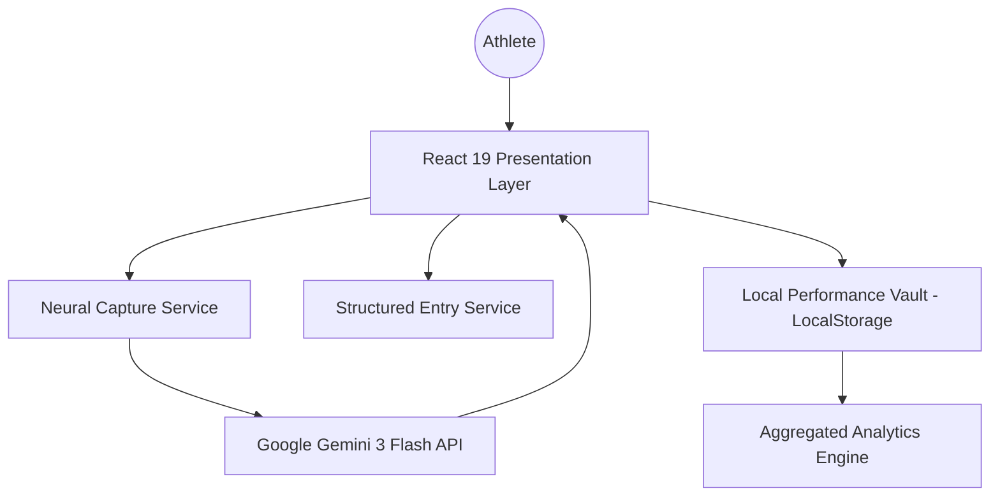

# PitchPerfect 2026: System Architecture

This document describes the technical architecture and design patterns governing the PitchPerfect 2026 application.

## 🏛️ High-Level Architecture
PitchPerfect is built as a **Single Page Application (SPA)** following the **Local-First** paradigm. It leverages edge-based Generative AI for unstructured data processing.

## 🧩 Architectural Layers

### 1. Presentation Layer (UI/UX)
- **Framework**: React 19 (ESM).
- **Design System**: Atomic components built with Tailwind CSS.
- **Iconography**: Lucide React for consistent tactical visual language.
- **Philosophy**: "Arena Aesthetics" — High-contrast, dark-mode-first, high-density performance data.

### 2. Neural Core (Intelligence Layer)
- **Engine**: Gemini 3 Flash.
- **Capabilities**:
    - **Voice Processing**: Multi-modal audio-to-JSON extraction.
    - **Natural Language Understanding (NLU)**: Parsing messy post-match notes into structured link-up data.
    - **Schema Enforcement**: Utilizing `responseSchema` to ensure 100% predictable data structures from LLM outputs.

### 3. Storage & Persistence (Local-First)
- **Strategy**: Privacy by design. All match archives are stored client-side.
- **Technology**: `localStorage` with JSON serialization.
- **Lifecycle**: 
    1. Capture (AI/Manual).
    2. Validate (Neural Confirmation).
    3. Commit (Storage).
    4. Aggregate (Dashboard).

### 4. Audio Processing Pipeline
- **Web Audio API**: Real-time waveform visualization during "Neural Listening".
- **Capture**: `MediaRecorder` API capturing `.webm` blobs.
- **Transmission**: Base64 encoding for stateless delivery to the Gemini Multi-modal endpoint.

## 📊 Data Model (Match Entity)
The primary data unit is the `Match` object:

| Field | Type | Description |
| :--- | :--- | :--- |
| `id` | UUID/String | Unique identifier (Timestamp-based) |
| `opponent` | String | Opposing team name |
| `finalScore` | String | E.g., "3 - 2" |
| `myGoals` | Integer | Individual goal tally |
| `assistFrom` | String | Key link-up partner for goals |
| `myAssists` | Integer | Individual assist tally |
| `scorer` | String | Teammate who finished the assist |
| `teammates` | String | CSV of the day's squad |
| `rating` | Float | Neural Performance Rating (1-10) |
| `timestamp` | Long | Unix epoch for sorting |

## 🛡️ Security & Privacy
- **Zero Cloud Persistence**: Match data never touches a proprietary backend.
- **API Key Handling**: Injected via environment variables; never exposed to client-side storage where possible.
- **Transparency**: User reviews all AI-extracted data before committing to the vault.
